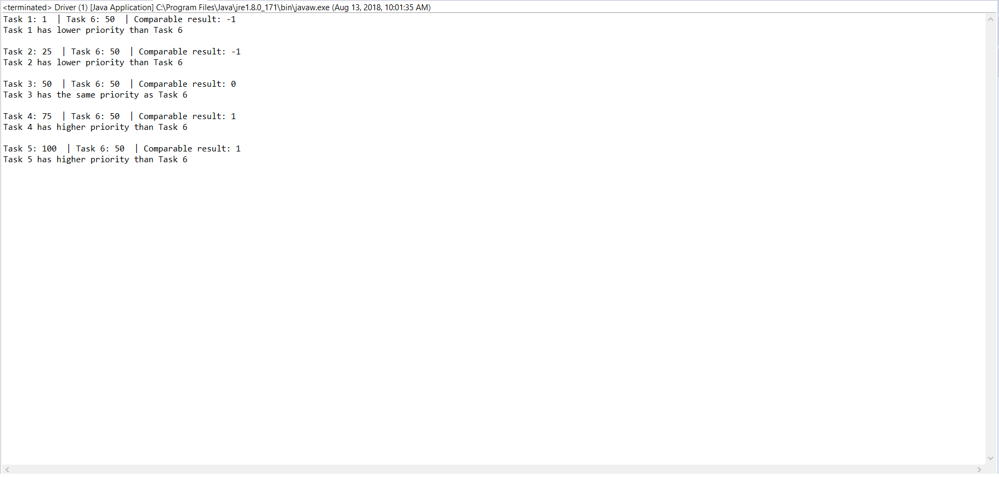

# Assignment 2
This assignment focuses on implementing a simple interface that defines a setter/getter method 
pair for priority-based classes. In this assignment, the *Task* class represents some task on a
to-do list, and possesses a priority attribute. The *Priority* interface allows the programmer to 
implement the setter/getter method to create tasks with different priorities and keep track of the
various tasks.

Furthermore, the *java.lang.Comparable* interface is also implemented in *Task* class to demonstrate
the usefulness of such interfaces. Its compareTo() method is defined in Task, and allows user to compare
the difference in priority between various tasks.  

## Screenshot

