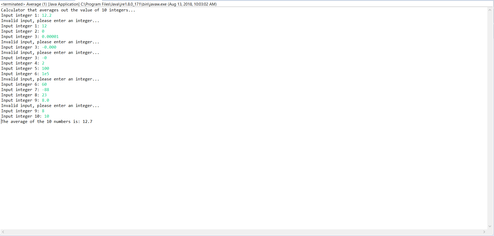
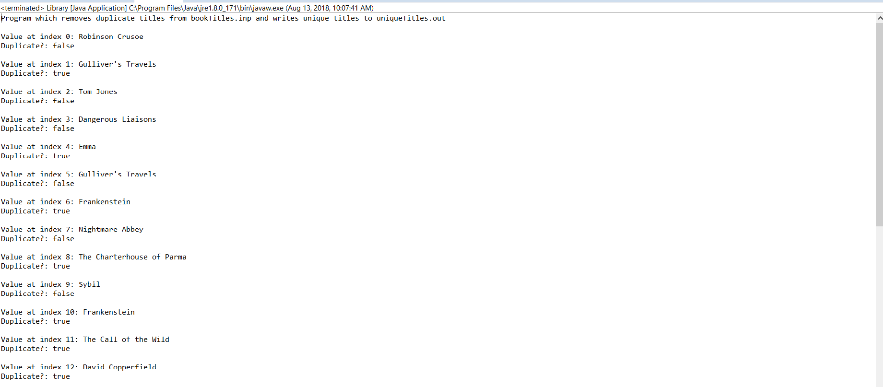
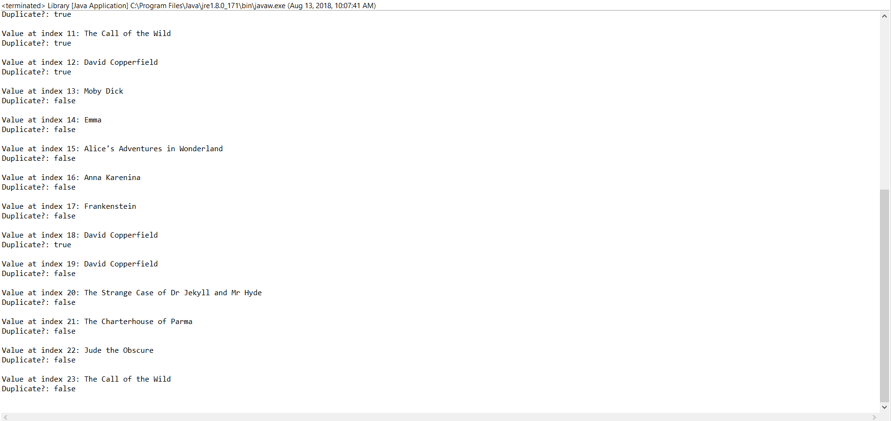

# Assignment 3
This assignment focuses on the use of arrays to complete 2 different tasks, both of which use input streeams to 
process an appropriate output

## Part 1
*Average.java* uses a Scanner object to prompt the user for 10 integers. If decimal places or letters are entered, 
the program handles the parse exception by notifying the user of the invaid input, and asking them again for a
valid input. the final result is the average value, which is displaces as a double value

### Screenshot

## Part 2
*Library.java* uses a BufferedReader to read each line of a file containing book titles, some of which are duplicates
of each other. The program cycles through each title and removes any duplicates, before writing the unique titles
into an output file. 

### Screenshots

