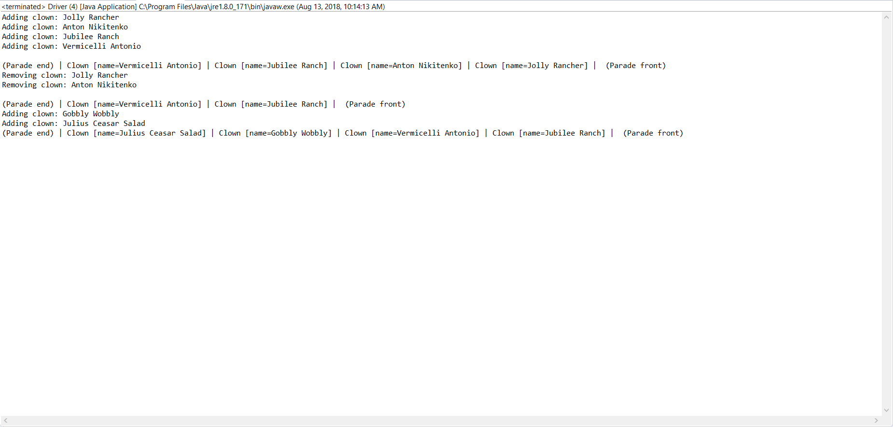
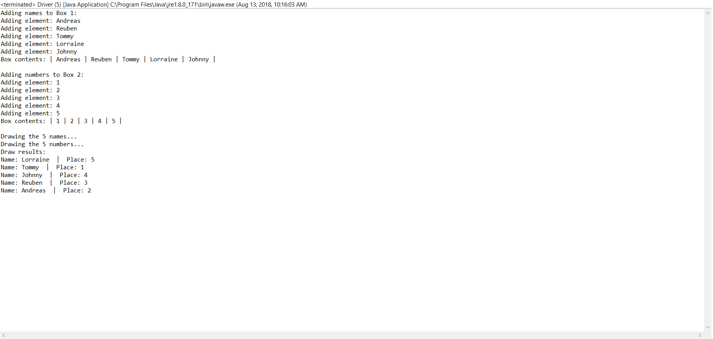

# Assignment 4
This assignment focues on the use of stacks, an abstract data type (ADT) to complete 2 different tasks with an output

## Part 1
This program implements a user-defined ADT stack in *Parade.java*, to add clowns (defined in *Clown.java*) to a parade,
with clowns only being able to join a parade at the back of the parade, and leave at the front of the parade. This implementation
is similar to a Drop-out stack. The program outputs the order of the clowns in the parade as well as their names.

### Screenshot

## Part 2
This program implements a generic ADT in *BoxDrawer.java* for the purpose of drawing the generic types stored in the ADT 
in a random fashion. This is used to draw a collection of Strings at random (people's names), and 5 integer numbers at random. This 
is used to assign people to a number, such as a table.

### Screenshot

