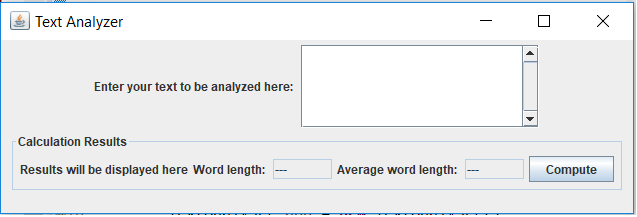
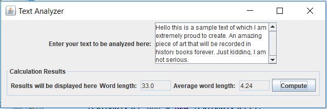
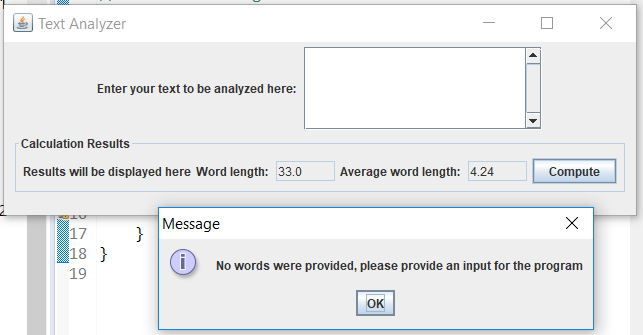
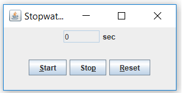
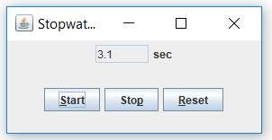
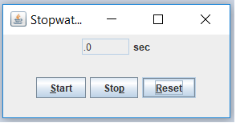

# Assignment 5
This assignment focuses on the use of GUI components, events, and listeners to build 2 programs that the user can interact with.

## Part 1
This program is a GUI application that allows the user to input text into a *JTextArea*, and calculates the total word length and
average word length. Through tests, most unicode characters are recognized as separate words. If no words are provided, the program
displays a *JOptionPane* message dialog telling the user to provide a valid input 

### Screenshots

## Part 2
This program is a GUI application that uses a *Timer* class to act as a stopwatch. The application provides the user with a start, stop, and reset button, and uneditable field to output the time in seconds to 1 decimal place. The application has been tested such that all combinations of start, stop, and reset button clicks work as intended. Mnemonics are also attached to the buttons to allow the user to 
activate the stopwatch easily.

### Screenshots

